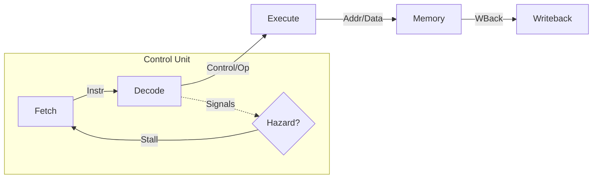

# Hansen Architecture Deep Dive

## 1. Core Microarchitecture
The Hansen Core is a **5-Stage In-Order Pipelined RISC-V** processor.

### 2.1 Pipeline Stages (Visual)

### 2.2 Stage Details
- **IF (Fetch)**: Fetches instruction from `imem` at `PC`. PC + 4 logic. IMEM Access.
- **ID (Instruction Decode)**: Decodes opcode, reads Register File (`regs`), handles Hazards.
- **EX (Execute)**: Performs ALU operations, resolves Branches (`BEQ`, `JAL`).
- **MEM (Memory)**: Accesses Data Memory (`dmem`) for Load/Store.
- **WB (Writeback)**: Writes result back to Register File.

---

## 2. Hazard Handling Strategy

To ensure correctness without the complexity of full forwarding grids, we implement a **Hardware Interlock (Stall)** strategy.

### A. Data Hazards (RAW - Read After Write)
Occurs when an instruction depends on the result of a previous instruction that hasn't reached Writeback yet.

**Detection Logic**:
*   **ID/EX** Register receives a **Bubble (NOP)**.
*   The stall persists until the dependency clears (writes to Register File).

### B. Control Hazards (Branching)
Occurs when a branch/jump decision changes the PC, invalidating instructions already fetched.

**Resolution**:
*   **Flush**: When `BEQ` (Taken) or `JAL/JALR` is detected in EX stage, the instructions in IF/ID and ID/EX are **Flushed** (zeroed out).
*   **Penalty**: 2 cycles (standard for this topology).

### C. Structural Hazards
*   **Memory**: Separate Instruction (IMEM) and Data (DMEM) buses prevent structural hazards on memory access (Harvard Architecture behavior).
*   **Register File**: Supports simultaneous Read (Decode) and Write (Writeback). 
     *   *Note*: If Read and Write occur to the same register in the same cycle, the Register File logic must handle logical forwarding (Internal Forwarding) or Write-First. Currently relies on checking hazards to simply Stall, avoiding this edge case entirely.

---

## 4. Future Optimizations (v2.0 Roadmap)
While the currrent **Stall** strategy ensures correctness, it incurs performance penalties (KPI: CPI ~1.2).

### Planned Improvements:
1.  **Data Forwarding Unit**: Bypass grid to feed ALU results directly to next instruction, eliminating most RAW stalls.
2.  **Branch Prediction**: Static "Predict-Not-Taken" is currently used. Dynamic prediction (2-bit saturating counter) will reduce flush penalty.
3.  **Instruction Cache (I-Cache)**: Replace current scratchpad model with a direct-mapped cache for larger programs.

---

## 3. Bus & Memory map
(See `HARDWARE_INTERFACE.md`)
