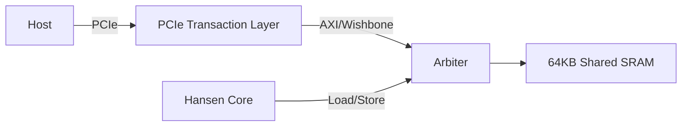

# HANSEN ARCHITECTURE REFERENCE

## 1. System Overview

The Hansen Accelerator SoC consists of a single-cycle RISC-V core tightly coupled with a local scratchpad memory, accessible by the host via a PCIe BAR0 interface.

### Block Diagram

## 2. Processor Core

### ISA Subset
The core implements the **RV32I** base integer instruction set, excluding:
- `FENCE`, `ECALL`, `EBREAK` (System instructions not needed for pure kernels yet).
- `CSR` instructions (Status registers are memory mapped for simplicity).

### Pipeline Stages
Currently implemented as a **Single Cycle** machine for simplicity and determinism.
1. **Fetch**: Read instruction from `PC` address in Memory.
2. **Decode**: Extract fields (opcode, rs1, rs2, rd, imm).
3. **Execute**: ALU operations (Add, Sub, Logic) or Address Calculation.
4. **Memory**: Read/Write data if Load/Store.
5. **Writeback**: Update `rd` register.

## 3. Memory Map

| Address Range | Size | Description |
|---|---|---|
| `0x0000_0000` - `0x0000_FFFF` | 64 KB | Local SRAM (Instructions + Data) |
| `0x8000_0000` - `0x8000_0004` | 4 B | Control Register (Start/Stop) |
| `0x8000_0008` - `0x8000_000C` | 4 B | Status Register (Busy/Done) |

## 4. Host Interface (PCIe)

The host interacts with the accelerator through Memory Mapped I/O.
1. **Load Kernel**: Host writes binary machine code to `0x0000_0000`.
2. **Load Data**: Host writes initial data structures to `0x0000_1000` (convention).
3. **Start**: Host writes `1` to `0x8000_0000`.
4. **Poll**: Host reads `0x8000_0008` until `Done`.
5. **Read Result**: Host reads data from `0x0000_1000`.

## 5. Software Stack

- **Kernel**: Code running on the accelerator (bare metal, no OS).
- **Driver**: User-space library handling the MMIO transactions.
- **Application**: Game or Simulation executable linking `libhansen`.
