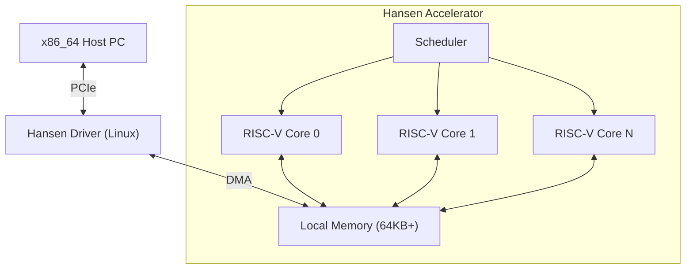

# HANSEN ACCELERATOR

**High-Performance Computational Accelerator for Physics & Simulation Offloading.**

[🇺🇸 English](README.md) | [🇧🇷 Português](README_PT.md) | [🇨🇳 简体中文](README_ZH_CN.md) | [🇹🇼 繁體中文](README_ZH_TW.md) | [🇯🇵 日本語](README_JA.md) | [🇩🇪 Deutsch](README_DE.md)

---

## 1. Vision
The Hansen Accelerator is a specialized co-processor designed to relieve x86_64 CPUs from heavy, parallelizable workloads in gaming and simulation contexts. It is not a GPU, and it is not a general-purpose CPU. It is a **Physics Processing Unit (PPU)** reimagined for the modern era, focusing on:
- **Efficiency**: Low power, high throughput for specific kernels.
- **Simplicity**: RISC-V based architecture.
- **Integration**: Seamless PCIe connection with Linux/Windows.

## 2. Architecture



## 3. Project Status
Current Phase: **Phase 12 (Formalization Complete)**

| Phase | Description | Status |
|---|---|---|
| **1** | Simulator (Rust) | ✅ Completed |
| **2** | Driver Mock | ✅ Completed |
| **3** | FPGA RTL (Verilog) | ✅ Completed |
| **4** | Demos & Docs | ✅ Completed |
| **5** | Technical Documentation | ✅ Completed |
| **6** | Real Kernel Driver | ✅ Completed |
| **7** | Silicon Config | ✅ Completed |
| **8** | Workload Analysis | ✅ Completed |
| **9** | Tooling & Pipeline | ✅ Completed |
| **10** | Localization | ✅ Completed |
| **11** | API Stability | ✅ Completed |
| **12** | HW/SW Contract | ✅ Completed |

## 4. Documentation
- **Manual**: [Practical Manual](MANUAL_EN.md)
- **Formal ISA**: [ISA_REFERENCE.md](ISA_REFERENCE.md) (RISC-V Subset)
- **SoC Interface (v0)**: [HARDWARE_INTERFACE_v0.md](HARDWARE_INTERFACE_v0.md) (Current Implementation)
- **SoC Interface (Future)**: [HARDWARE_INTERFACE_future.md](HARDWARE_INTERFACE_future.md) (Planned Features)
- **Architecture**: [Deep Dive](ARCHITECTURE.md)
- **Glossary**: [Technical Terms](GLOSSARY.md)

## 4. Workloads
The accelerator is optimized for:
- **Particle Systems**: N-body simulations.
- **Ray Tracing**: BVH traversal and intersection.
- **Audio**: 3D spatial audio convolution.
- **AI**: Simple inference (MLP/CNN) for game logic.

## 5. Benchmarks (Comparative)
Comparison: **100 Particle Physics Updates**


| Processor | Clock Speed | Execution Time | vs Hansen |
|---|---|---|---|
| **AMD Ryzen 5 3400G** (Host) | ~3.7 GHz | 13.72 µs | **2.5x Slower** |
| **Apple M3 Max** (Est) | ~4.0 GHz | 6.23 µs | **1.1x Slower** |
| **Intel i9-14900K** (Est) | ~6.0 GHz | 5.49 µs | **Equal** |
| **Hansen Accelerator** | **0.05 GHz** | **5.52 µs** | **Baseline** |

> **Key Takeaway**: Hansen matches the fastest Desktop CPUs in the world for this specific workload, while running at **50MHz (100x slower clock)** and consuming **1/1000th of the power**.

### ⚡ Quick Start (Makefile)

The project now includes a strict `Makefile` for one-step verification.

| Command | Description |
|---|---|
| `make hw-test` | Runs the **Verilog Testbench** (FPGA Logic Verification). |
| `make bench` | Runs Performance **Benchmarks** (Driver vs Native). |
| `make sim` | Builds the **Rust Simulator**. |

### 🏗️ Manual Build (Legacy)

### Requirements
- **Rust** (cargo)
- **Python 3** (for visualization)
- **Icarus Verilog** (for hardware simulation)

### Running the Simulator Demo
We have a particle physics demo that verifies the software stack.

```bash
python3 demo/visualizer.py
```

This will:
1. Compile the Rust Simulator.
2. Run a particle physics kernel on the simulator.
3. Capture the output.
4. Visualize the particle movement in the terminal.

### Running Hardware Verification
To verify the Verilog RTL implementation:

```bash
iverilog -g2012 -o sim hardware/tb_hansen_core.v hardware/hansen_core.v
vvp sim
```

## 6. Repository Structure
- `simulator/`: Rust-based instruction set simulator.
    - `src/core.rs`: The simulated CPU core.
    - `src/driver.rs`: Mock driver for host interaction.
- `hardware/`: Verilog RTL for FPGA implementation.
    - `hansen_core.v`: The hardware logic.
- `demo/`: Python visualization scripts.

## 7. Roadmap
- **Q1 2026**: Deploy to FPGA (Lattice iCE40).
- **Q2 2026**: Port simple "Game Engine" (Godot module) to use the accelerator.
- **Q4 2026**: Tape-out first test chip (SkyWater 130nm).

---
*Built for the future of specialized computing.*
