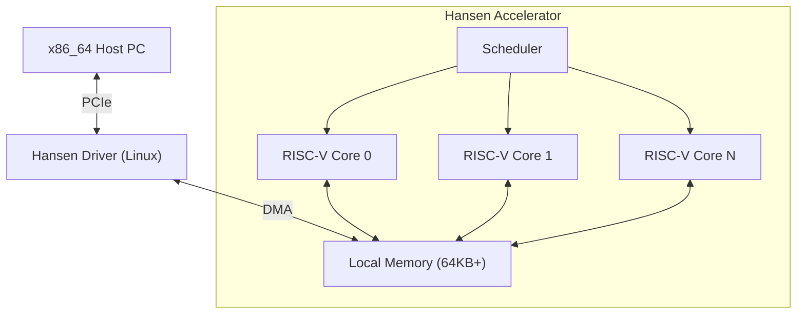

# HANSEN ACCELERATOR

**Hochleistungs-Rechenbeschleuniger für Physik & Simulation Offloading.**

[🇺🇸 English](README.md) | [🇧🇷 Português](README_PT.md) | [🇨🇳 简体中文](README_ZH_CN.md) | [🇹🇼 繁體中文](README_ZH_TW.md) | [🇯🇵 日本語](README_JA.md) | [🇩🇪 Deutsch](README_DE.md)

---

## 1. Vision
Der Hansen Accelerator ist ein spezialisierter Co-Prozessor, der entwickelt wurde, um x86_64-CPUs von schweren, parallelisierbaren Arbeitslasten in Gaming- und Simulationskontexten zu entlasten. Es ist keine GPU und auch keine Allzweck-CPU. Es ist eine für die moderne Ära neu konzipierte **Physics Processing Unit (PPU)**, mit Fokus auf:
- **Effizienz**: Geringer Stromverbrauch, hoher Durchsatz für spezifische Kernel.
- **Einfachheit**: RISC-V basierte Architektur.
- **Integration**: Nahtlose PCIe-Verbindung mit Linux/Windows.

## 2. Architektur



## 3. Projektstatus
Aktuelle Phase: **Phase 9 (Tooling & Performance)**

| Phase | Beschreibung | Status |
|---|---|---|
| **1** | Simulator (Rust) | ✅ Abgeschlossen |
| **2** | Driver Mock | ✅ Abgeschlossen |
| **3** | FPGA RTL (Verilog) | ✅ Abgeschlossen |
| **4** | Demos & Docs | ✅ Abgeschlossen |
| **5** | Technische Dokumentation | ✅ Abgeschlossen |
| **6** | Echtes Kernel Driver | ✅ Abgeschlossen |
| **7** | Silizium-Konfiguration | ✅ Abgeschlossen |
| **8** | Toolchain (Assembler) | ✅ Abgeschlossen |
| **9** | Pipeline & C-Compiler | ✅ Abgeschlossen |

## 4. Arbeitslasten (Workloads)
Der Beschleuniger ist optimiert für:
- **Partikelsysteme**: N-Body-Simulationen.
- **Ray Tracing**: BVH-Traversierung und Schnittpunktberechnung.
- **Audio**: 3D-Audio-Faltung.
- **KI**: Einfache Inferenz (MLP/CNN) für Spielelogik.

## 5. Ausführung

### Anforderungen
- **Rust** (cargo)
- **Python 3** (für Visualisierung und Tools)
- **Icarus Verilog** (für Hardwaresimulation)

### Simulator-Demo ausführen
Wir haben eine Teilchenphysik-Demo, die den Software-Stack verifiziert.

```bash
python3 demo/visualizer.py
```

Dies wird:
1. Den Rust-Simulator kompilieren.
2. Einen Teilchenphysik-Kernel ausführen.
3. Die Ausgabe erfassen.
4. Die Teilchenbewegung im Terminal visualisieren.

### Hardware-Verifizierung ausführen
Um die RTL-Implementierung in Verilog zu überprüfen:

```bash
iverilog -g2012 -o sim hardware/tb_hansen_core.v hardware/hansen_core.v
vvp sim
```

## 6. Repository-Struktur
- `simulator/`: Rust-basierter Befehlssatzsimulator.
- `hardware/`: Verilog RTL für FPGA/ASIC-Implementierung.
- `kernel_driver/`: Echtes Linux-Kernel-Modul (C).
- `tools/`: Mini-C-Compiler und Assembler.
- `asic/`: OpenLane-Fertigungskonfigurationen.

## 7. Roadmap
- **Q1 2026**: Bereitstellung auf FPGA (Lattice iCE40).
- **Q2 2026**: Portierung einer kleinen Engine (Godot-Modul) zur Nutzung des Beschleunigers.
- **Q4 2026**: Tape-out des ersten Testchips (SkyWater 130nm).

---
*Gebaut für die Zukunft des spezialisierten Rechnens.*
