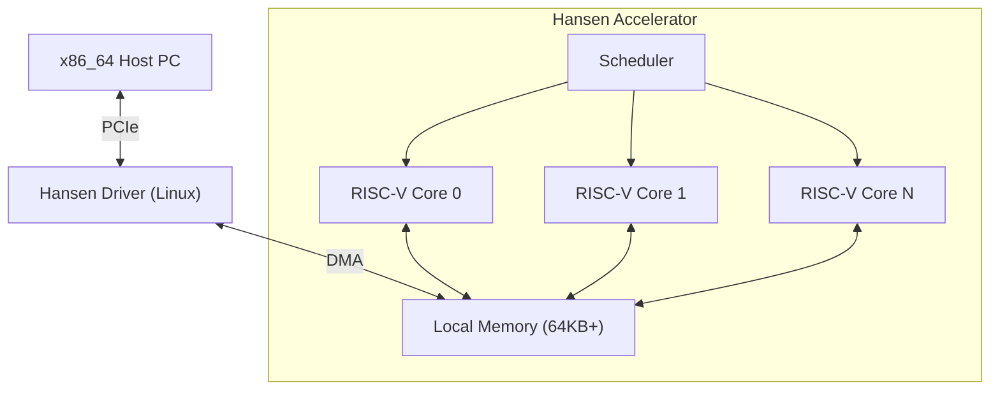

# HANSEN ACCELERATOR

**物理およびシミュレーションオフロードのための高性能計算アクセラレータ。**

[🇺🇸 English](README.md) | [🇧🇷 Português](README_PT.md) | [🇨🇳 简体中文](README_ZH_CN.md) | [🇹🇼 繁體中文](README_ZH_TW.md) | [🇯🇵 日本語](README_JA.md) | [🇩🇪 Deutsch](README_DE.md)

---

## 1. ビジョン
Hansen Acceleratorは、ゲームやシミュレーションのコンテキストにおいて、並列化可能な高負荷なワークロードからx86_64 CPUを解放するために設計された、専用のコプロセッサです。GPUではなく、汎用CPUでもありません。現代のために再考された**物理演算装置 (PPU)**であり、以下に焦点を当てています：
- **効率**: 低消費電力、特定カーネルでの高スループット。
- **シンプルさ**: RISC-Vベースのアーキテクチャ。
- **統合**: Linux/WindowsとのシームレスなPCIe接続。

## 2. アーキテクチャ



## 3. プロジェクトステータス
現在のフェーズ: **フェーズ9 (ツーリング & パフォーマンス)**

| フェーズ | 説明 | ステータス |
|---|---|---|
| **1** | シミュレータ (Rust) | ✅ 完了 |
| **2** | ドライバー モック | ✅ 完了 |
| **3** | FPGA RTL (Verilog) | ✅ 完了 |
| **4** | デモ & ドキュメント | ✅ 完了 |
| **5** | 技術ドキュメント | ✅ 完了 |
| **6** | リアルカーネルドライバー | ✅ 完了 |
| **7** | シリコン構成 | ✅ 完了 |
| **8** | ツールチェーン (アセンブラ) | ✅ 完了 |
| **9** | パイプライン & Cコンパイラ | ✅ 完了 |

## 4. ワークロード
このアクセラレータは以下に最適化されています：
- **パーティクルシステム**: N体シミュレーション。
- **レイトレーシング**: BVHトラバーサルと交差判定。
- **オーディオ**: 3D空間オーディオ畳み込み。
- **AI**: ゲームロジック向けの単純な推論 (MLP/CNN)。

## 5. 実行方法

### 要件
- **Rust** (cargo)
- **Python 3** (可視化とツール用)
- **Icarus Verilog** (ハードウェアシミュレーション用)

### シミュレータデモの実行
ソフトウェアスタックを検証する素粒子物理学デモがあります。

```bash
python3 demo/visualizer.py
```

これにより以下が実行されます：
1. Rustシミュレータのコンパイル。
2. 素粒子物理学カーネルの実行。
3. 出力のキャプチャ。
4. ターミナルでの粒子移動の可視化。

### ハードウェア検証の実行
Verilog RTL実装を検証するには：

```bash
iverilog -g2012 -o sim hardware/tb_hansen_core.v hardware/hansen_core.v
vvp sim
```

## 6. リポジトリ構造
- `simulator/`: Rustベースの命令セットシミュレータ。
- `hardware/`: FPGA/ASIC実装用のVerilog RTL。
- `kernel_driver/`: リアルLinuxカーネルモジュール (C)。
- `tools/`: Mini-Cコンパイラとアセンブラ。
- `asic/`: OpenLane製造構成。

## 7. ロードマップ
- **Q1 2026**: FPGA (Lattice iCE40) へのデプロイ。
- **Q2 2026**: アクセラレータを使用するための小型エンジン (Godotモジュール) の移植。
- **Q4 2026**: 最初のテストチップ (SkyWater 130nm) のテープアウト。

---
*専用コンピューティングの未来のために構築されました。*
