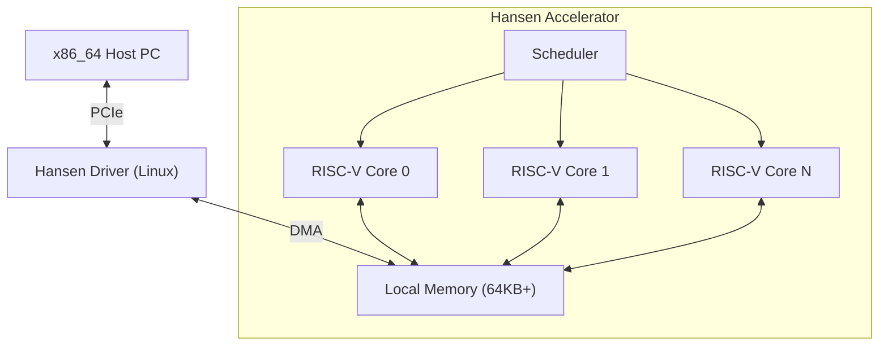

# HANSEN ACCELERATOR

**Acelerador Computacional de Alta Performance para Offloading de Física & Simulação.**

[🇺🇸 English](README.md) | [🇧🇷 Português](README_PT.md)

---

## 1. Visão
O Hansen Accelerator é um co-processador especializado projetado para aliviar CPUs x86_64 de cargas de trabalho pesadas e paralelizáveis em contextos de jogos e simulação. Não é uma GPU, e não é uma CPU de propósito geral. É uma **Unidade de Processamento de Física (PPU)** reimaginada para a era moderna, focando em:
- **Eficiência**: Baixo consumo, alto throughput para kernels específicos.
- **Simplicidade**: Arquitetura baseada em RISC-V.
- **Integração**: Conexão PCIe transparente com Linux/Windows.

## 2. Arquitetura



## 3. Status do Projeto
Fase Atual: **Fase 9 (Tooling & Performance)**

| Fase | Descrição | Status |
|---|---|---|
| **1** | Simulador (Rust) | ✅ Concluído |
| **2** | Driver Mock | ✅ Concluído |
| **3** | FPGA RTL (Verilog) | ✅ Concluído |
| **4** | Demos & Docs | ✅ Concluído |
| **5** | Documentação Técnica | ✅ Concluído |
| **6** | Driver Kernel Real | ✅ Concluído |
| **7** | Config de Silício | ✅ Concluído |
| **8** | Toolchain (Assembler) | ✅ Concluído |
| **9** | Pipeline & Compilador C | ✅ Concluído |

## 4. Cargas de Trabalho
O acelerador é otimizado para:
- **Sistemas de Partículas**: Simulações N-body.
- **Ray Tracing**: Travessia de BVH e intersecção.
- **Áudio**: Convolução de áudio espacial 3D.
- **IA**: Inferência simples (MLP/CNN) para lógica de jogo.

## 5. Como Rodar

### Requisitos
- **Rust** (cargo)
- **Python 3** (para visualização e ferramentas)
- **Icarus Verilog** (para simulação de hardware)

### Rodando o Demo do Simulador
Temos um demo de física de partículas que verifica o stack de software.

```bash
python3 demo/visualizer.py
```

Isso irá:
1. Compilar o Simulador Rust.
2. Rodar um kernel de física de partículas.
3. Capturar a saída.
4. Visualizar o movimento das partículas no terminal.

### Rodando Verificação de Hardware
Para verificar a implementação RTL em Verilog:

```bash
iverilog -g2012 -o sim hardware/tb_hansen_core.v hardware/hansen_core.v
vvp sim
```

## 6. Estrutura do Repositório
- `simulator/`: Simulador de conjunto de instruções baseado em Rust.
- `hardware/`: RTL Verilog para implementação em FPGA/ASIC.
- `kernel_driver/`: Módulo de Kernel Linux real (C).
- `tools/`: Compilador Mini-C e Assembler.
- `asic/`: Configurações de fabricação OpenLane.

## 7. Roadmap
- **Q1 2026**: Deploy em FPGA (Lattice iCE40).
- **Q2 2026**: Portar pequena engine (Godot module) para usar o acelerador.
- **Q4 2026**: Tape-out do primeiro chip de teste (SkyWater 130nm).

---
*Construído para o futuro da computação especializada.*
