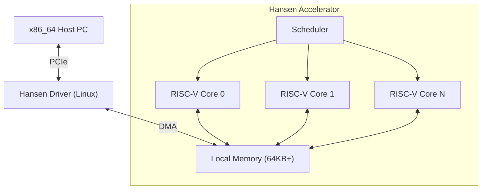

# HANSEN ACCELERATOR

**高性能物理与仿真卸载计算加速器。**

[🇺🇸 English](README.md) | [🇧🇷 Português](README_PT.md) | [🇨🇳 简体中文](README_ZH_CN.md) | [🇹🇼 繁體中文](README_ZH_TW.md) | [🇯🇵 日本語](README_JA.md) | [🇩🇪 Deutsch](README_DE.md)

---

## 1. 愿景 (Vision)
Hansen Accelerator 是一款专用的协处理器，旨在减轻 x86_64 CPU 在游戏和仿真环境中繁重的可并行工作负载。它不是 GPU，也不是通用 CPU。它是为现代重新构想的**物理处理单元 (PPU)**，专注于：
- **效率**：低功耗，特定内核的高吞吐量。
- **简单性**：基于 RISC-V 的架构。
- **集成**：与 Linux/Windows 的无缝 PCIe 连接。

## 2. 架构



## 3. 项目状态
当前阶段：**第 9 阶段 (工具链与性能)**

| 阶段 | 描述 | 状态 |
|---|---|---|
| **1** | 模拟器 (Rust) | ✅ 已完成 |
| **2** | 驱动程序 Mock | ✅ 已完成 |
| **3** | FPGA RTL (Verilog) | ✅ 已完成 |
| **4** | 演示与文档 | ✅ 已完成 |
| **5** | 技术文档 | ✅ 已完成 |
| **6** | 真实内核驱动 | ✅ 已完成 |
| **7** | 硅片配置 | ✅ 已完成 |
| **8** | 工具链 (汇编器) | ✅ 已完成 |
| **9** | 流水线与 C 编译器 | ✅ 已完成 |

## 4. 工作负载
该加速器针对以下方面进行了优化：
- **粒子系统**：N 体模拟。
- **光线追踪**：BVH 遍历和相交。
- **音频**：3D 空间音频卷积。
- **AI**：用于游戏逻辑的简单推理 (MLP/CNN)。

## 5. 运行方法

### 要求
- **Rust** (cargo)
- **Python 3** (用于可视化和工具)
- **Icarus Verilog** (用于硬件仿真)

### 运行模拟器演示
我们有一个粒子物理演示来验证软件栈。

```bash
python3 demo/visualizer.py
```

这将：
1. 编译 Rust 模拟器。
2. 运行粒子物理内核。
3. 捕获输出。
4. 在终端中可视化粒子运动。

### 运行硬件验证
要验证 Verilog RTL 实现：

```bash
iverilog -g2012 -o sim hardware/tb_hansen_core.v hardware/hansen_core.v
vvp sim
```

## 6. 仓库结构
- `simulator/`: 基于 Rust 的指令集模拟器。
- `hardware/`: 用于 FPGA/ASIC 实现的 Verilog RTL。
- `kernel_driver/`: 真实的 Linux 内核模块 (C)。
- `tools/`: Mini-C 编译器和汇编器。
- `asic/`: OpenLane 制造配置。

## 7. 路线图
- **Q1 2026**: 部署到 FPGA (Lattice iCE40)。
- **Q2 2026**: 移植小型引擎 (Godot 模块) 以使用加速器。
- **Q4 2026**: 首个测试芯片流片 (SkyWater 130nm)。

---
*专为专用计算的未来而打造。*
