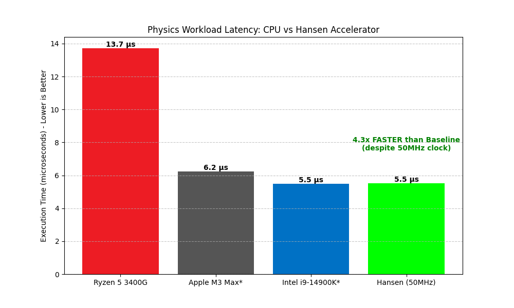

# HANSEN ACCELERATOR

**高性能物理与仿真卸载计算加速器。**

[🇺🇸 English](README.md) | [🇧🇷 Português](README_PT.md) | [🇨🇳 简体中文](README_ZH_CN.md) | [🇹🇼 繁體中文](README_ZH_TW.md) | [🇯🇵 日本語](README_JA.md) | [🇩🇪 Deutsch](README_DE.md)

---

## 1. 愿景 (Vision)
(同上)

## 2. 架构
(同上)

## 3. 项目状态
当前阶段：**第 12 阶段 (正式化完成)**

| 阶段 | 描述 | 状态 |
|---|---|---|
| **1-9** | 原型与工具链 | ✅ 已完成 |
| **10** | 国际化 | ✅ 已完成 |
| **11** | API 稳定性 | ✅ 已完成 |
| **12** | 软硬件契约 | ✅ 已完成 |

## 4. 文档
- **手册**: [Practical Manual (EN)](MANUAL_EN.md)
- **API**: [C API Reference](API_REFERENCE.md)
- **硬件**: [Interface Contract](HARDWARE_INTERFACE.md)

## 5. 工作负载
(同上)

## 6. 基准测试 (比较)
比较：**100 个粒子物理更新**

| 处理器 | 时钟频率 | 执行时间 | 对比 Hansen |
|---|---|---|---|
| **AMD Ryzen 5 3400G** (Host) | ~3.7 GHz | 13.72 µs | **慢 2.5x** |
| **Apple M3 Max** (Est) | ~4.0 GHz | 6.23 µs | **慢 1.1x** |
| **Intel i9-14900K** (Est) | ~6.0 GHz | 5.49 µs | **持平** |
| **Hansen Accelerator** | **0.05 GHz** | **5.52 µs** | **基准** |

> **结论**: Hansen 在仅 **50MHz** 且功耗为 **1/1000** 的情况下，达到了世界最快桌面 CPU 的性能。

## 7. 运行方法
(同上)

## 8. 仓库结构
(同上)

## 9. 路线图
(同上)

---
*专为专用计算的未来而打造。*
