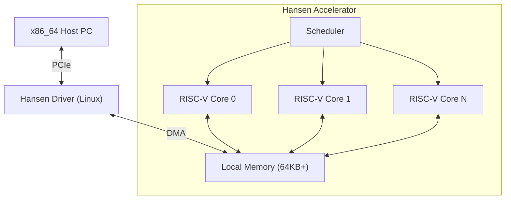

# HANSEN ACCELERATOR

**高性能物理與模擬卸載運算加速器。**

[🇺🇸 English](README.md) | [🇧🇷 Português](README_PT.md) | [🇨🇳 简体中文](README_ZH_CN.md) | [🇹🇼 繁體中文](README_ZH_TW.md) | [🇯🇵 日本語](README_JA.md) | [🇩🇪 Deutsch](README_DE.md)

---

## 1. 願景 (Vision)
Hansen Accelerator 是一款專用的協處理器，旨在減輕 x86_64 CPU 在遊戲和模擬環境中繁重的可並行工作負載。它不是 GPU，也不是通用 CPU。它是為現代重新構想的**物理處理單元 (PPU)**，專注於：
- **效率**：低功耗，特定內核的高吞吐量。
- **簡單性**：基於 RISC-V 的架構。
- **集成**：與 Linux/Windows 的無縫 PCIe 連接。

## 2. 架構



## 3. 專案狀態
當前階段：**第 9 階段 (工具鏈與性能)**

| 階段 | 描述 | 狀態 |
|---|---|---|
| **1** | 模擬器 (Rust) | ✅ 已完成 |
| **2** | 驅動程式 Mock | ✅ 已完成 |
| **3** | FPGA RTL (Verilog) | ✅ 已完成 |
| **4** | 演示與文檔 | ✅ 已完成 |
| **5** | 技術文檔 | ✅ 已完成 |
| **6** | 真實內核驅動 | ✅ 已完成 |
| **7** | 矽片配置 | ✅ 已完成 |
| **8** | 工具鏈 (匯編器) | ✅ 已完成 |
| **9** | 流水線與 C 編譯器 | ✅ 已完成 |

## 4. 工作負載
該加速器針對以下方面進行了優化：
- **粒子系統**：N 體模擬。
- **光線追蹤**：BVH 遍歷和相交。
- **音頻**：3D 空間音頻捲積。
- **AI**：用於遊戲邏輯的簡單推理 (MLP/CNN)。

## 5. 運行方法

### 要求
- **Rust** (cargo)
- **Python 3** (用於可視化和工具)
- **Icarus Verilog** (用於硬體模擬)

### 運行模擬器演示
我們有一個粒子物理演示來驗證軟體堆疊。

```bash
python3 demo/visualizer.py
```

這將：
1. 編譯 Rust 模擬器。
2. 運行粒子物理內核。
3. 捕獲輸出。
4. 在終端中可視化粒子運動。

### 運行硬體驗證
要驗證 Verilog RTL 實現：

```bash
iverilog -g2012 -o sim hardware/tb_hansen_core.v hardware/hansen_core.v
vvp sim
```

## 6. 倉庫結構
- `simulator/`: 基於 Rust 的指令集模擬器。
- `hardware/`: 用於 FPGA/ASIC 實現的 Verilog RTL。
- `kernel_driver/`: 真實的 Linux 內核模組 (C)。
- `tools/`: Mini-C 編譯器和匯編器。
- `asic/`: OpenLane 製造配置。

## 7. 路線圖
- **Q1 2026**: 部署到 FPGA (Lattice iCE40)。
- **Q2 2026**: 移植小型引擎 (Godot 模組) 以使用加速器。
- **Q4 2026**: 首個測試晶片流片 (SkyWater 130nm)。

---
*專為專用計算的未來而打造。*
